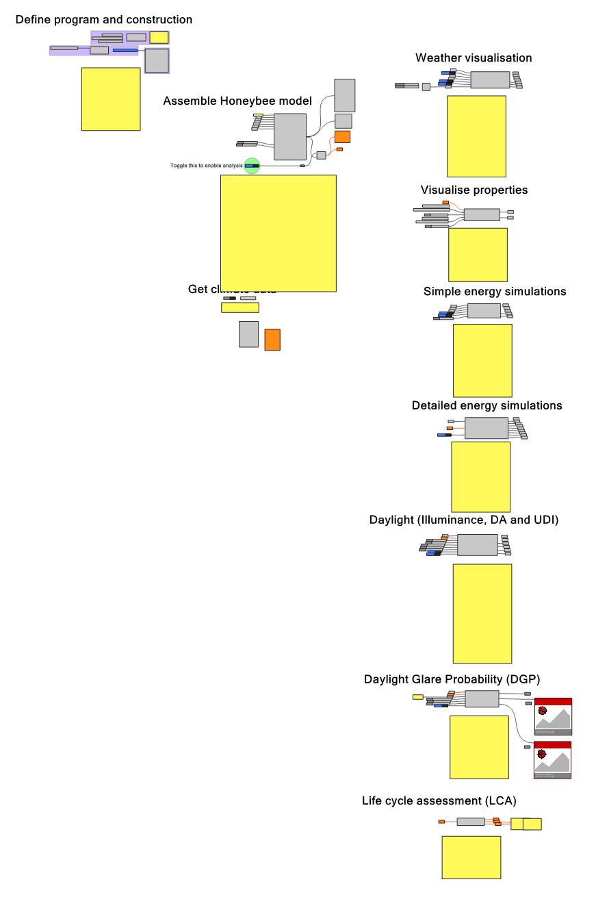

# ACE 405 BPS/LCA Script

This script was first developed to support the learning in the master's course ACE405 (Design and performance optimization in architecture). It is intended to streamline the creation of a simple analysis model, running of BPS/LCA simulations, and streamline the outputs.

## Contents

* This readme file
* [version]_ace405_analysis_script.gh

## Prerequisites

* The current script requires Ladybug Tools 1.6.0 (full installation including OpenStudio and Radiance) to be installed to work.

## Use

* Open the .gh script in Grasshopper for Rhino 7 and follow the instructions in the script to define and analyse a building model

### Submodules

* Modules included in the GH definition are (230904):
    * Modelling
        * Define program and construction
        * Assemble Honeybee model
        * Get climate data
    * Analysis
        * Weather visualisation
        * Visualise properties
        * Simple energy simulations
        * Detailed energy simulations
        * Daylight
        * Glare
        * LCA

## Contact

* For support, contact Toivo Säwén at sawen@chalmers.se