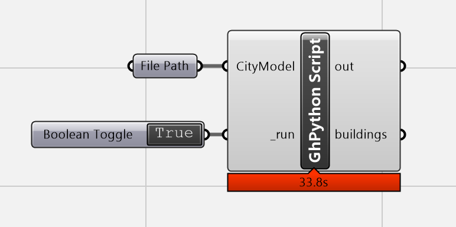

# DTCC CityModel Parser

The DTCC Builder platform generates a CityModel JSON that can be used to create BREP with surfaces instead of a mesh.

Note: This parser has been updated to work with the dtcc city.to_json() schema

The output mesh can then be passed into energy models.

