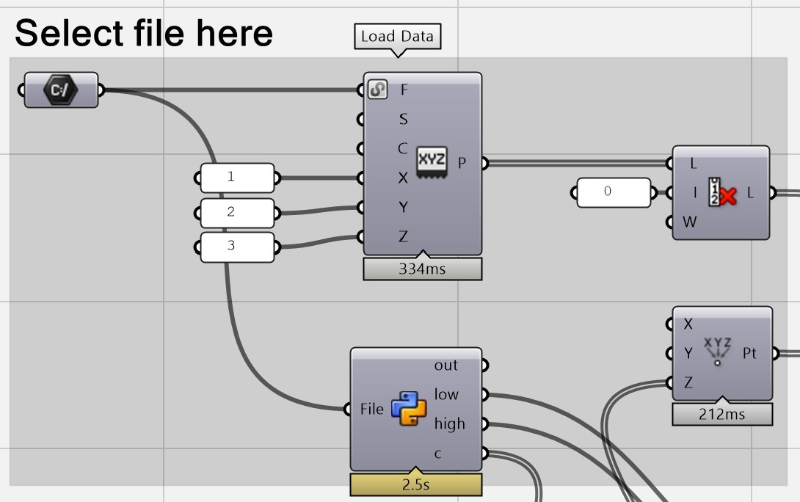

# DTCC Wind Comfort parser.
## A grasshopper script to parse a csv file (x,y,z,value)

This script reads a csv file generated by IBOFlow in the DTCC Wind Comfort project and visualises it using the Ladybug Tools plugin.

Date: 2022 December 12  
Author: Sanjay Somanath  
Contact:  sanjay.somanath@chalmers.se

### Dependancies
This script makes use of 
* Ladybug tools, Version=1.5.0
* CockroachGH, Version=1.0.0.0

## Using the script

* Select the file path of the results file in the "file path" component.
This reads the csv file and identifies the x,y,z and the value components.

Below is a sample of the csv file

|LawsonLDDC|Points:0|Points:1|Points:2|
|----------|--------|--------|--------|
|2         |-147.75 |-238.5  |47.461  |
|2         |-147    |-238    |47.511  |
|2         |-147    |-241    |47.299  |
|2         |-146.25 |-240.5  |47.349  |
|2         |-147.75 |-240    |47.354  |
|2         |-147    |-239.5  |47.405  |
|2         |-146.25 |-239    |47.455  |
|2         |-147    |-235    |47.723  |
|2         |-146.25 |-234.5  |47.773  |
|2         |-147.75 |-234    |47.779  |
|2         |-146.25 |-236    |47.667  |
|2         |-147.75 |-235.5  |47.673  |
|2         |-146.25 |-237.5  |47.561  |
|2         |-147.75 |-237    |47.567  |
|2         |-147    |-236.5  |47.617  |

* Then the script uses the CockroachGH plugin to load the points as a point cloud.