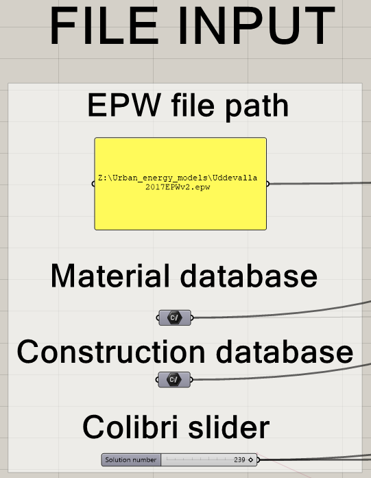
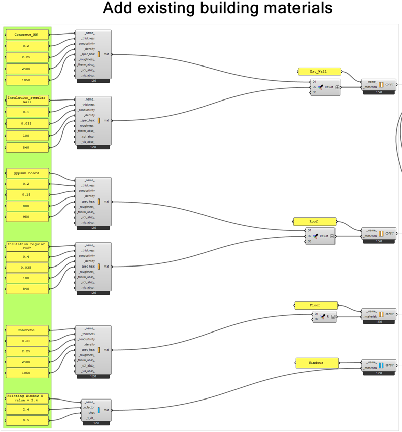
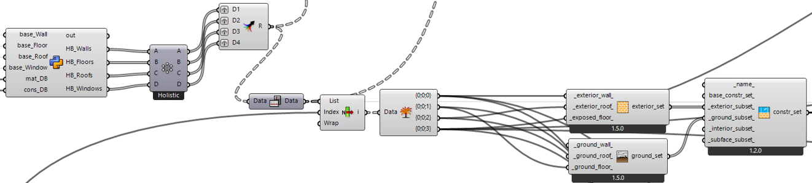
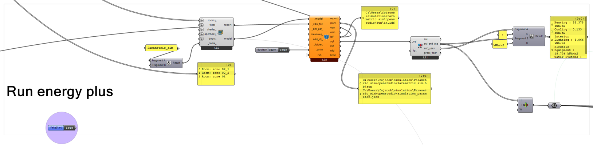
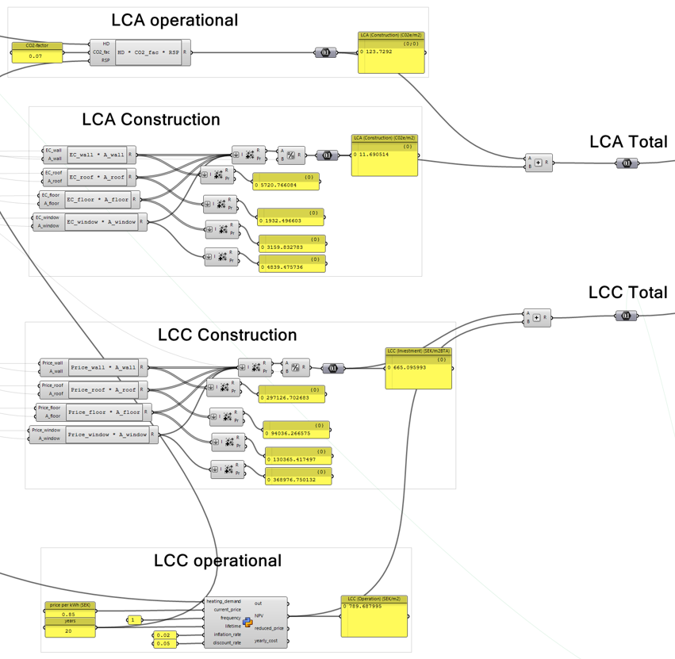
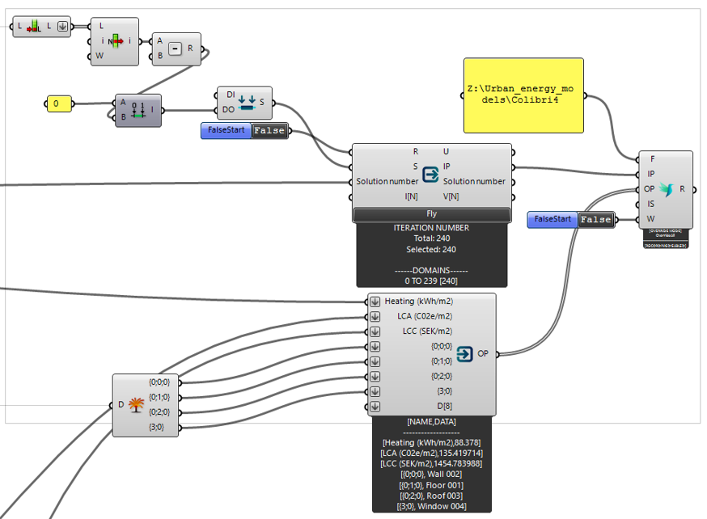
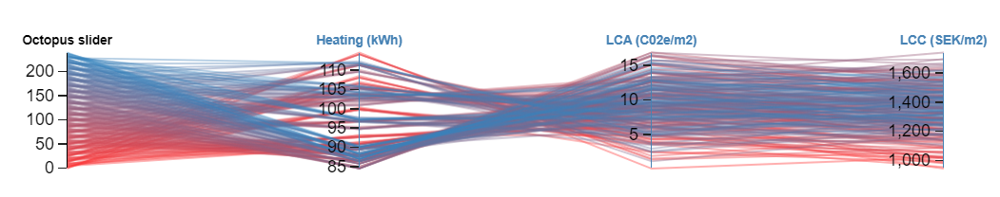

# A Grasshopper script to perform optimization of renovation options based on LCA and LCC
The script uses the following plug-ins

- Ladybug tools, version 1.5.0
- Colibri, version 2.0.0

Date : 01-07-23  
Author : Jacob Forsberg  
Contact : fojacob@chalmers.se   

## Starting the script

The 3D-model in Grasshopper is generated from a plan drawing in Rhino.

The script requires a material database, construction database and an epw-file to run. 

The construction database contains renovation packages for the buildings walls, roof, floor and windows. The material databse contains the properties of the materials that make up the constructions.

### CSV-database

Below are examples of the format for the material-, and construction database

| UUID    | Material                        | Thickness | Conductivity | Cost  | Embodied carbon | Density | U-value |
| ------- | ------------------------------- | --------- | ------------ | ----- | --------------- | ------- | ------- |
| ins_001 | 70 rock wool-36 (B=455) (W)    | 0.07      | 0.02         | 59.7  | 2.60            | 80.0    | na      |
| ins_002 | 120 rock wool-36 (B=455) (W)   | 0.12      | 0.02         | 95.7  | 4.45            | 80.0    | na      |
| ins_003 | 120 glass wool (R)              | 0.12      | 0.042        | 89.2  | 1.82            | 15.0    | na      |
| ins_004 | 70 polystyrene (F)              | 0.07      | 0.04         | 57.1  | 4.48            | 250.0   | na      |
| boa_001 | 13 gypsum board (W-R)           | 0.013     | 0.21         | 39.7  | 2.04            | 760.0   | na      |
| boa_002 | 21 plywood K20/70 treated (R)   | 0.021     | 0.09         | 340.0 | 3.64            | 460.0   | na      |
| boa_003 | 21 plywood K20/70 (W)           | 0.021     | 0.09         | 325.0 | 3.65            | 460.0   | na      |
| boa_004 | 15 plywood (F)                  | 0.015     | 0.09         | 235.0 | 2.60            | 460.0   | na      |
| boa_005 | 11 OSB board (W-R)              | 0.011     | 0.13         | 121.5 | 2.51            | 607.0   | na      |
| boa_006 | 22 Chip board (F)               | 0.022     | 0.15         | 128.2 | 6.08            | 600.0   | na      |
| win_001 | window_wood/alu fixed 3-glass U=0.8  | na        | na           | 6345.8 | 70.58           | 35.0    | 0.8     |
| win_002 | window_wood/alu fixed 3 glass U=1.1 | na        | na           | 4444.4 | 70.58           | 35.0    | 1.1     |
| win_003 | window_alu fixed 3 glass U=1.1    | na        | na           | 2791.7 | 16.04           | 40.0    | 1.1     |
| win_004 | window_wood outward 3 glass U=1.2 | na        | na           | 4158.3 | 54.54           | 36.0    | 1.2     |

| Element | Identifier | Layer | UUID    |
| ------- | ---------- | ----- | ------- |
| Wall    | 001        | 00    | ins_001 |
| Wall    | 001        | 01    | boa_001 |
| Wall    | 002        | 00    | ins_002 |
| Wall    | 002        | 01    | boa_003 |
| Wall    | 003        | 00    | ins_001 |
| Wall    | 003        | 01    | boa_001 |
| Wall    | 003        | 02    | ins_002 |
| Wall    | 003        | 03    | boa_003 |
| Roof    | 001        | 00    | ins_003 |
| Roof    | 001        | 01    | boa_001 |
| Roof    | 002        | 00    | ins_003 |
| Roof    | 002        | 01    | boa_002 |
| Roof    | 003        | 00    | ins_003 |
| Roof    | 003        | 01    | boa_005 |
| Floor   | 001        | 00    | ins_004 |
| Floor   | 001        | 01    | boa_004 |
| Floor   | 002        | 00    | ins_004 |
| Floor   | 002        | 01    | boa_006 |
| Window  | 001        | 00    | win_001 |
| Window  | 002        | 00    | win_002 |
| Window  | 003        | 00    | win_003 |
| Window  | 004        | 00    | win_004 |

## Existing building

The current materials in the buildings wall, roof, floor and windows is added as Honeybee materials

The current building materials are combined with the renovation packages with a python script that gives all possible solutions for walls, roof, floor and windows combined.

## Results

- The heating demand is computed using Energyplus

- The total emboddied carbon and cost is divided into a construction part and an operational part

- Colibri is used to iterate through the entire domain of the results and write the result into a csv-file

- The results can be read and visualized in the design explorer 

[DesignExplorer](http://tt-acm.github.io/DesignExplorer/)
