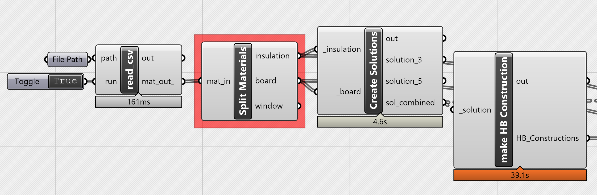

# A script to create HB materials and Component solutions from a CSV for parametric sensitivity analysis


The script makes use of a helper csv file with the material properties and LCA/LCC Parameters.

The solutions are created using the Honeybee library.

Some assumtions are made within the script for all materials. 6,479 Solutions are created from the example CSV.

Sample HB material
```
Construction,
 Pla_Min_Pla_Min_Pla,      !- name
 Plasterboard,             !- layer 1
 Mineral_wool,             !- layer 2
 Plasterboard,             !- layer 3
 Mineral_wool,             !- layer 4
 Plasterboard;             !- layer 5
```

```
Plasterboard
MediumRough
0.02
0.4
760.0
950.0
0.9
0.7
0.9
Mineral_wool
MediumRough
0.1
0.038
300.0
950.0
0.9
0.7
0.9
Plasterboard
MediumRough
0.02
0.4
760.0
950.0
0.9
0.7
0.9
Mineral_wool
MediumRough
0.1
0.038
300.0
950.0
0.9
0.7
0.9
Plasterboard
MediumRough
0.02
0.4
760.0
950.0
0.9
0.7
0.9
```

```
            {0;0;0;0}
0. name
1. roughness
2. thickness {m}
3. conductivity {W/m-K}
4. density {kg/m3}
5. specific heat {J/kg-K}
6. thermal absorptance
7. solar absorptance
8. visible absorptance
            {0;0;0;1}
0. name
1. roughness
2. thickness {m}
3. conductivity {W/m-K}
4. density {kg/m3}
5. specific heat {J/kg-K}
6. thermal absorptance
7. solar absorptance
8. visible absorptance
            {0;0;0;2}
0. name
1. roughness
2. thickness {m}
3. conductivity {W/m-K}
4. density {kg/m3}
5. specific heat {J/kg-K}
6. thermal absorptance
7. solar absorptance
8. visible absorptance
            {0;0;0;3}
0. name
1. roughness
2. thickness {m}
3. conductivity {W/m-K}
4. density {kg/m3}
5. specific heat {J/kg-K}
6. thermal absorptance
7. solar absorptance
8. visible absorptance
            {0;0;0;4}
0. name
1. roughness
2. thickness {m}
3. conductivity {W/m-K}
4. density {kg/m3}
5. specific heat {J/kg-K}
6. thermal absorptance
7. solar absorptance
8. visible absorptance

```