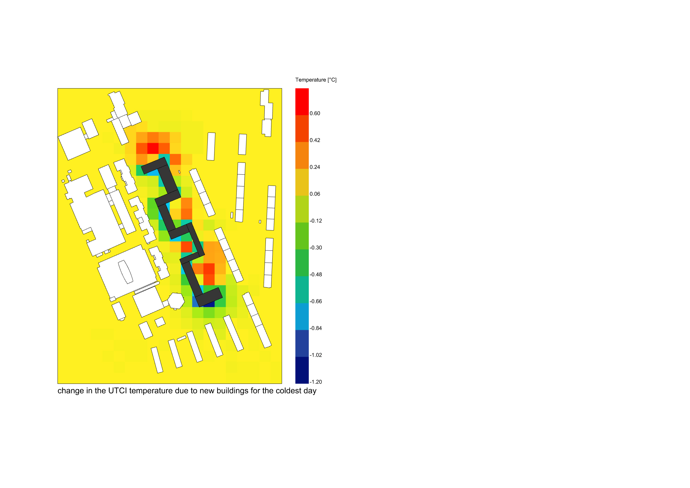

# LB_MRT_UTCI
## A grasshopper script to compare the results of outdoor sensation temperature (based on UTCI) in between the base case scenario and the one with applying additional new buildings; for the coldest and warmest day of the year. 

This script is based on the Rhino model with the layers of: existing buildings; analysis plane for measurement of changes within the surrounding; new options to compare.   AnalysisPlane is divided into segments with cendroids to measure perceived temperature. Calculations are conducted based on the LB UTCI Comfort component. Simultaneously based on the epw. file the coldest and warmest day of the year for the location are found. Then the results of UTCI for these days are extracted for both base case scenario and one including the additional new buildings. By using the substraction the information about changes of the UTCI for the second scenario are obtained. The results are visualised by LB Spatial Heatmap (colored grid on the plane).

  

Date: 2022 December 17  
Author:   Dominika Komisarczyk
Contact:  domkom@chalmers.se

### Dependancies
this script makes use of  
* Ladybug tools version 1.5.0 (OpenStudio, DragonFly, HoneyBee)
* epw file for the location

