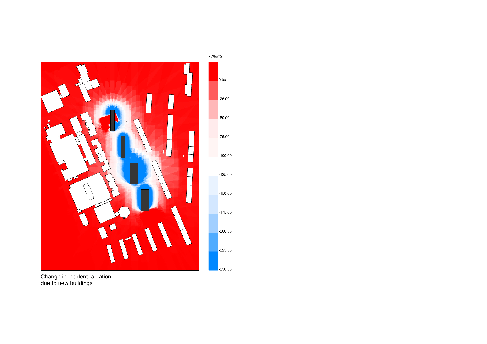

# LB_radiation
## A grasshopper script to conduct cumulative incident radiation analysis of the impact of the new buildings onto their surroundings and comparison between them

This script is based on the Rhino model with the layers of: existing buildings; analysis plane for measurement of changes within the surrounding; new options to compare.  

Based on the .epw file with the analysed location Cumulative Sky Matrix is created. Existing geometry from rhino model is imported into the grasshoper script. Two components of the Cumulative Incident Radiaton are created in order to compare later the results - to one only existing buildings are applied as the geometry, to the other: both of the existing and the new ones.To showcase the impact AnalysisPlane is implemented as the context for both iterations. 

Subsequently, substraction from new one is conducted to aquire results of the change in the incident radiation for the context and later to compare impact on the surouding of all the options. 

Date: 2022 December 16  
Author:   Dominika Komisarczyk  
Contact:  domkom@chalmers.se | https://github.com/dominikakomisarczyk

### Dependancies
this script makes use of  
* Ladybug tools version 1.5.0 (OpenStudio, DragonFly, HoneyBee)
* epw file for the location

