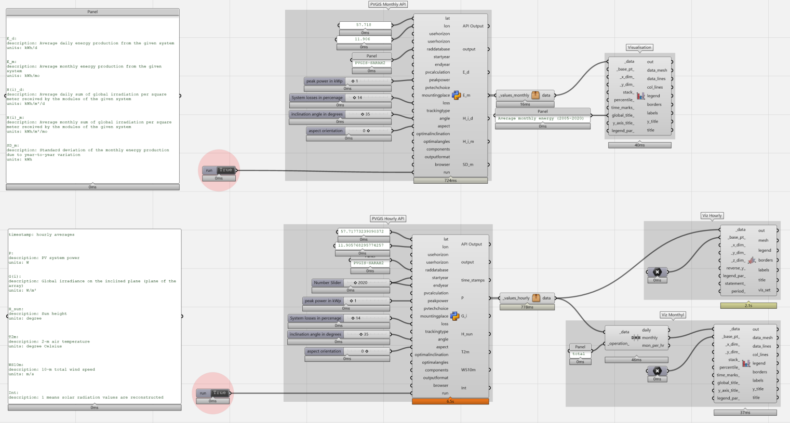
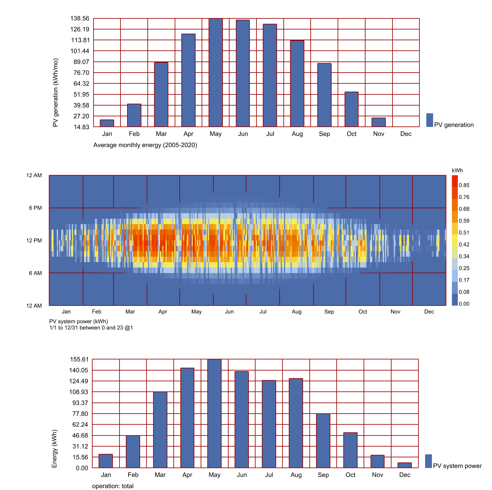

## Grasshopper Script Documentation for PVGIS API Integration
Author: Sanjay Somanath  
Contact: sanjay.somanath@chalmers.se  
Date: July 2024  

---
### Overview

This documentation provides a comprehensive guide on using a Grasshopper script to integrate with the PVGIS (Photovoltaic Geographical Information System) API. This script is designed to retrieve solar energy data and visualize it using Ladybug tools in Grasshopper. The script supports both monthly and hourly data retrieval modes.

### Example

Here are two images illustrating the Grasshopper canvas setup and the resulting visualizations:

#### Grasshopper Canvas

This image shows the Grasshopper canvas with the PVGIS API components and Ladybug visualization components set up:

#### Results

This image displays the results of the monthly, hourly, and hourly aggregated data visualizations using Ladybug:

This documentation should help users understand how to set up and use the Grasshopper script to retrieve and visualize solar energy data using the PVGIS API. For further customization and advanced usage, refer to the official documentation of PVGIS API and Ladybug tools.

### Contents

1. [Introduction](#introduction)
2. [Setup](#setup)
3. [Inputs and Outputs](#inputs-and-outputs)
4. [Running the Script](#running-the-script)
5. [Visualizing the Data](#visualizing-the-data)
6. [Error Handling](#error-handling)
7. [References](#references)

---

### Introduction

The Grasshopper script interfaces with the PVGIS API, a powerful tool for estimating the performance of photovoltaic (PV) systems. By providing specific geographical and system parameters, users can retrieve detailed data on solar radiation and energy production. This data is then visualized using Ladybug, a popular suite of environmental analysis tools within Grasshopper.

### Setup

To get started with this script, ensure you have the following setup:

1. **Rhino and Grasshopper**: Install Rhino (a 3D computer graphics and computer-aided design application) and its visual programming language plugin, Grasshopper.
2. **Ladybug Tools**: Install Ladybug tools, which are essential for environmental design and analysis in Grasshopper.

### Inputs and Outputs

#### Inputs

The script requires several parameters to fetch and process the data accurately. These inputs are classified into mandatory and optional categories:

- **Latitude (lat)**: Latitude of the location in decimal degrees. Southern latitudes are negative. This is mandatory.
- **Longitude (lon)**: Longitude of the location in decimal degrees. Western longitudes are negative. This is mandatory.
- **Use Horizon (usehorizon)**: An optional parameter that, when set, considers the shadows from the horizon.
- **User Horizon (userhorizon)**: Heights of the horizon at equidistant directions. Optional.
- **Radiation Database (raddatabase)**: Specifies the radiation database to be used. Default is "PVGIS-SARAH".
- **Start Year (startyear)** and **End Year (endyear)**: Defines the period for which hourly data is retrieved. These are optional.
- **PV Calculation (pvcalculation)**: Determines whether to calculate only solar radiation (0) or also estimate PV production (1). Default is 1.
- **Peak Power (peakpower)**: The nominal power of the PV system in kilowatts. Mandatory if PV calculation is set to 1.
- **PV Technology Choice (pvtechchoice)**: The type of PV technology used. Default is "crystSi".
- **Mounting Place (mountingplace)**: The type of mounting for the PV modules. Mandatory if PV calculation is 1.
- **System Losses (loss)**: The percentage of system losses. Mandatory if PV calculation is 1.
- **Tracking Type (trackingtype)**: Type of sun tracking system used. Optional.
- **Inclination Angle (angle)**: The angle of the PV modules from the horizontal plane. Mandatory if PV calculation is 1.
- **Orientation Angle (aspect)**: The orientation angle of the PV modules. Mandatory if PV calculation is 1.
- **Optimal Inclination (optimalinclination)**: If set, calculates the optimum inclination angle. Optional.
- **Optimal Angles (optimalangles)**: If set, calculates both optimal inclination and orientation angles. Optional.
- **Components (components)**: If set, outputs beam, diffuse, and reflected radiation components. Optional.
- **Output Format (outputformat)**: The format of the output data (e.g., json, csv). Default is "json".
- **Browser (browser)**: If set to 1, specifies that the API call is made from a web browser. Optional.

#### Outputs

The script generates several outputs based on the input parameters and the data retrieved from the PVGIS API:

- **API Output**: The raw data retrieved from the PVGIS API, which can be in JSON or other formats depending on the specified output format.
- **Monthly Data**: Provides average monthly data, including daily and monthly energy production, irradiation, and standard deviation due to year-to-year variation.
- **Hourly Data**: Provides detailed hourly data, including PV system power, global irradiation, sun height, air temperature, wind speed, and solar radiation values.
- **Visualizations**: Visual representations of the data using Ladybug tools, including bar charts for monthly data and heatmaps for hourly data.

### Running the Script

To run the script effectively:

1. **Initialize Inputs**: Ensure all mandatory inputs are provided. The script will initialize default values for optional inputs if they are not specified.
2. **Set the `run` Parameter**: Toggle the `run` parameter to `True` to execute the script.
3. **Fetch Data**: The script constructs a URL based on the input parameters and makes an API call to the PVGIS server to fetch the required data.
4. **Handle Data**: The script processes the retrieved data, extracts relevant information, and prepares it for visualization.
5. **Visualize Data**: The script uses Ladybug components to create visualizations of the data, helping users understand the solar energy potential and performance of the PV system.

### Visualizing the Data

The visualizations provide a clear representation of the solar energy data:

1. **Monthly Averages**: The bar chart shows the average monthly energy production, helping identify the best and worst months for solar energy generation.
   
   
   
2. **Hourly Data**: The heatmap visualizes hourly PV system power over the year, highlighting patterns in energy production throughout the day and across different months.

   

3. **Combined Data**: Additional charts combine monthly and hourly data, providing a comprehensive view of the system's performance over different time scales.

### Error Handling

The script includes robust error handling mechanisms to manage various issues:

- **Missing Inputs**: If any mandatory input is missing, the script generates a warning message specifying which inputs are required.
- **API Call Failures**: If the API call fails due to network issues or invalid parameters, an appropriate error message is displayed.
- **Data Processing Errors**: Any issues during data processing, such as invalid JSON responses, trigger error messages to help diagnose the problem.

### References

- [PVGIS API Documentation](https://ec.europa.eu/jrc/en/pvgis)
- [Ladybug Tools Documentation](https://www.ladybug.tools/)

