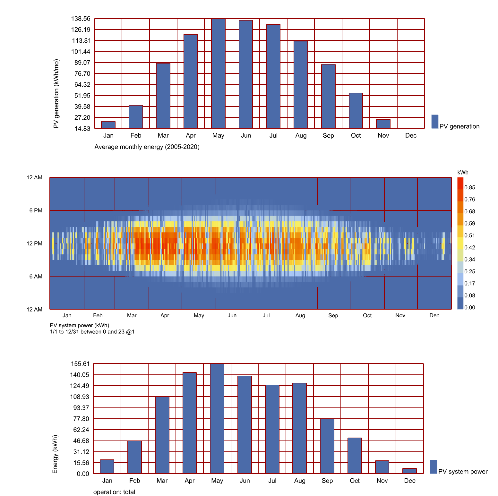

# Grasshopper Scripts

A collection of Grasshopper scripts created for various sustainable design projects.

## Overview

This repository contains a range of scripts used to automate and improve design workflows in computational sustainable design projects. Each script is tailored to address a unique design challenge.

## Table of Contents
- [Overview](#overview)
- [Scripts](#scripts)
- [Contributing](#contributing)

## Scripts

### DTCC CityJSON Parser
- **Description**: Parses CityJSON files to generate a 3D city model.
- **Screenshot**:
  

### HB DF EnergyVariations
- **Description**: Analyzes energy variations based on different design parameters.
- **Screenshot**:
  

### HB Construction from CSV
- **Description**: Reads CSV data to generate HB construction models.
- **Screenshot**:
  

### LB MRT UTCI
- **Description**: Provides UTCI analysis based on local meteorological data.
- **Screenshot**:
  

### LB Radiation
- **Description**: Analyzes radiation data for building performance.
- **Screenshot**:
  

### DecarbonAIte LCA LCC Optimizer
- **Description**: Optimizes life cycle assessment and cost based on design parameters.
- **Screenshot**:
  

### ACE405 BPS/LCA Script
- **Description**: Integrates BPS and LCA for sustainable design evaluations.
- **Screenshot**:
  

### Custom U-value to HB Construction
- **Description**: Converts material U-values to HB construction parameters.

### PVGIS API for Grasshopper
- **Description**: Uses the PVGIS API to analyze solar energy potential.
- **Screenshot**:
  

## Contributing

Feel free to contribute by opening issues or submitting pull requests. Please follow our code style guidelines and test your changes.
