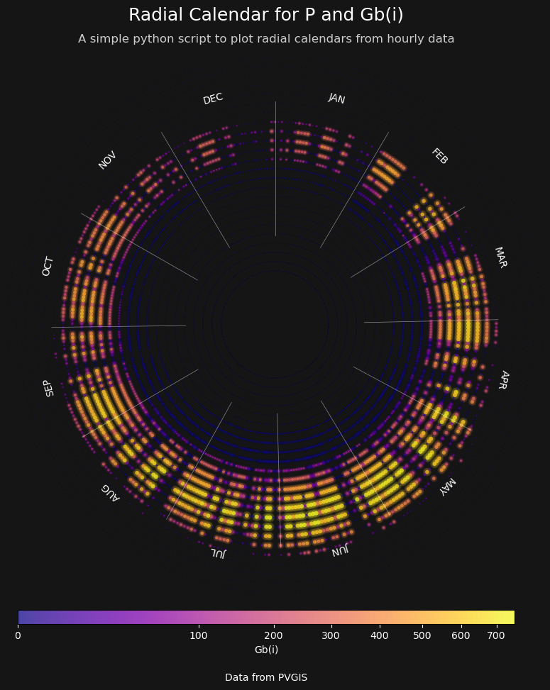
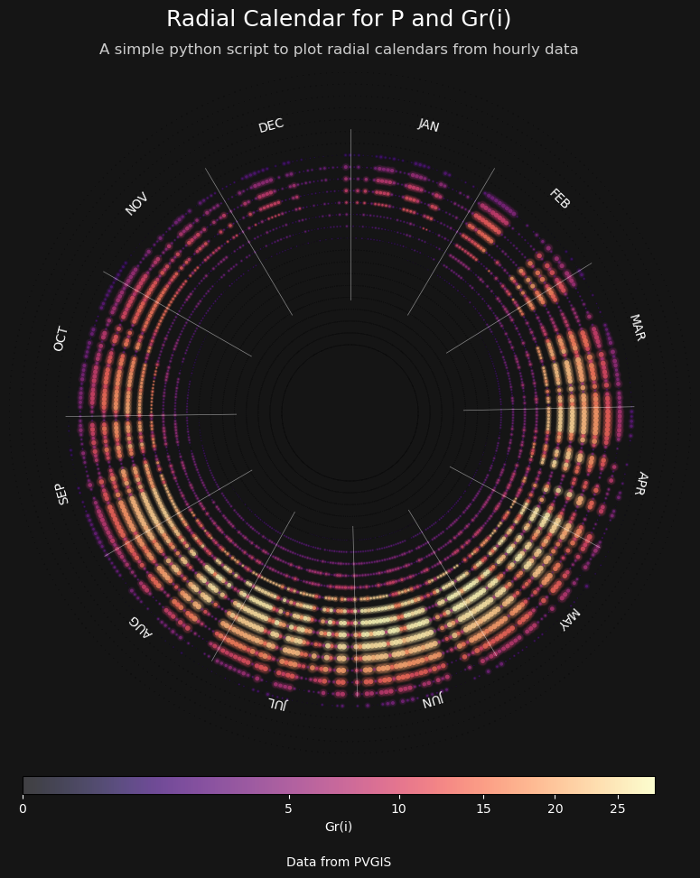
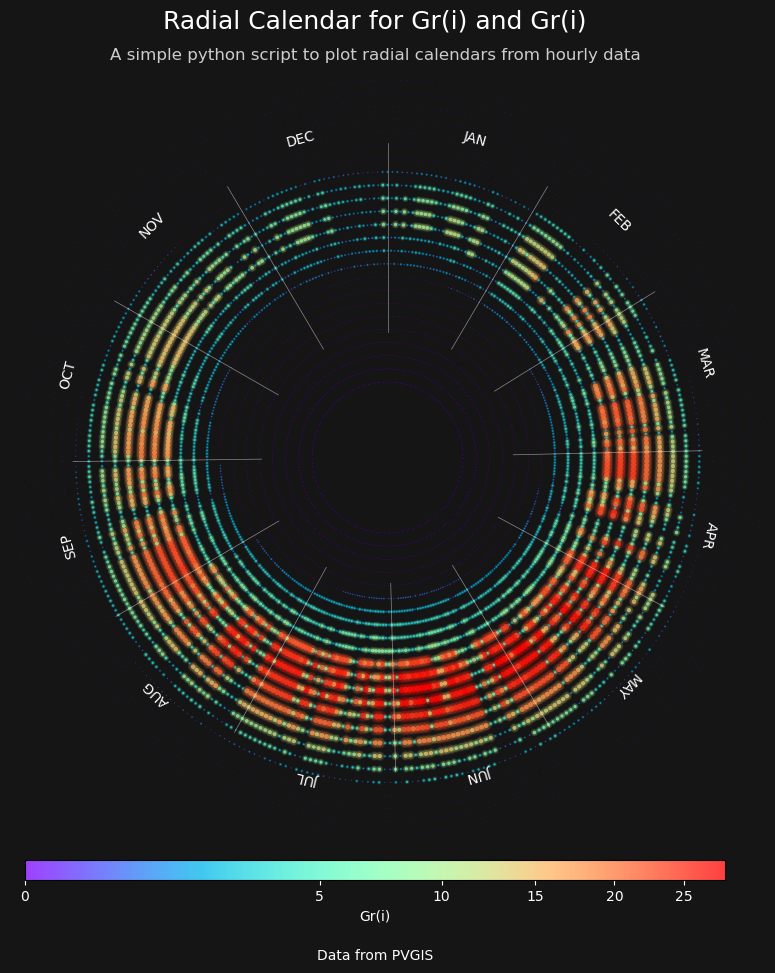

# Radial Calendar Plot

This project provides a Python script to create **radial calendar plots** using hourly data. The visualization is inspired by [Adam Heisserer's energy monitoring calendars](https://www.adamheisserer.com/#/energy-monitoring-calendars/). Radial calendar plots are a unique way to represent time-series data in a circular format, making it easier to identify patterns and trends over a year.

## Features

- **Customizable Inner and Outer Radii**: Adjust the size of the radial plot.
- **Dynamic Marker Sizes and Colors**: Visualize data intensity using marker size and color.
- **Support for Multiple Colormaps**: Choose from a variety of colormaps for better data representation.
- **Glow Effect**: Add a neon glow effect to enhance the visual appeal.
- **Month Dividers and Labels**: Clearly distinguish months with dividers and tangential labels.
- **Legend and Attribution**: Optionally include a legend and attribution text.

## Installation

1. Clone this repository:
   ```bash
   git clone https://github.com/your-repo/ComputationSustainableDesign.git
   ```
2. Install the required Python libraries:
   ```bash
   pip install matplotlib pandas numpy
   ```

## Usage

1. Prepare your data as a CSV file with hourly data for one year. Ensure the columns include:
   - A column for marker sizes (e.g., energy consumption).
   - A column for marker colors (e.g., temperature).

2. Import the `plot_radial_calendar` function and call it with your data:
   ```python
   from radial_plot import plot_radial_calendar
   import pandas as pd

   data = pd.read_csv('data.csv')
   plot_radial_calendar(
       data=data,
       size_column='size_column_name',
       colour_column='color_column_name',
       inner_radius=5,
       outer_radius=25,
       title="Radial Calendar Example",
       subtitle="Visualizing hourly data in a circular format",
       show_legend=True,
       glow=True
   )
   ```

3. Run the script and view the generated plot.

## Examples

Here are some examples of radial calendar plots generated using this script:

### Example 1


### Example 2


### Example 3


## Parameters

The `plot_radial_calendar` function supports the following parameters:

| Parameter          | Description                                                                 |
|--------------------|-----------------------------------------------------------------------------|
| `data`             | Pandas DataFrame containing hourly data for one year.                     |
| `size_column`      | Column name for marker sizes.                                              |
| `colour_column`    | Column name for marker colors.                                             |
| `inner_radius`     | Inner radius of the plot.                                                  |
| `outer_radius`     | Outer radius of the plot.                                                  |
| `min_size`         | Minimum marker size.                                                      |
| `max_size`         | Maximum marker size.                                                      |
| `bg_color`         | Background color of the plot.                                              |
| `line_color`       | Color for month divider lines.                                             |
| `month_label_color`| Color for month labels.                                                    |
| `title`            | Title of the plot.                                                        |
| `subtitle`         | Subtitle of the plot.                                                     |
| `show_legend`      | Whether to display a color legend.                                         |
| `fig_size`         | Size of the figure (width, height).                                        |
| `cmap`             | Colormap for the scatter plot.                                             |
| `year`             | Year for which the data is provided. Adjusts for leap years.              |
| `attribution_text` | Text to display at the bottom of the plot.                                 |
| `dpi`              | Resolution of the plot in dots per inch.                                  |
| `glow`             | Whether to add a neon glow effect to the markers.                         |


## Acknowledgments

- Inspired by [Adam Heisserer's energy monitoring calendars](https://www.adamheisserer.com/#/energy-monitoring-calendars/).
- Developed as part of the **Computation Sustainable Design** research group.

