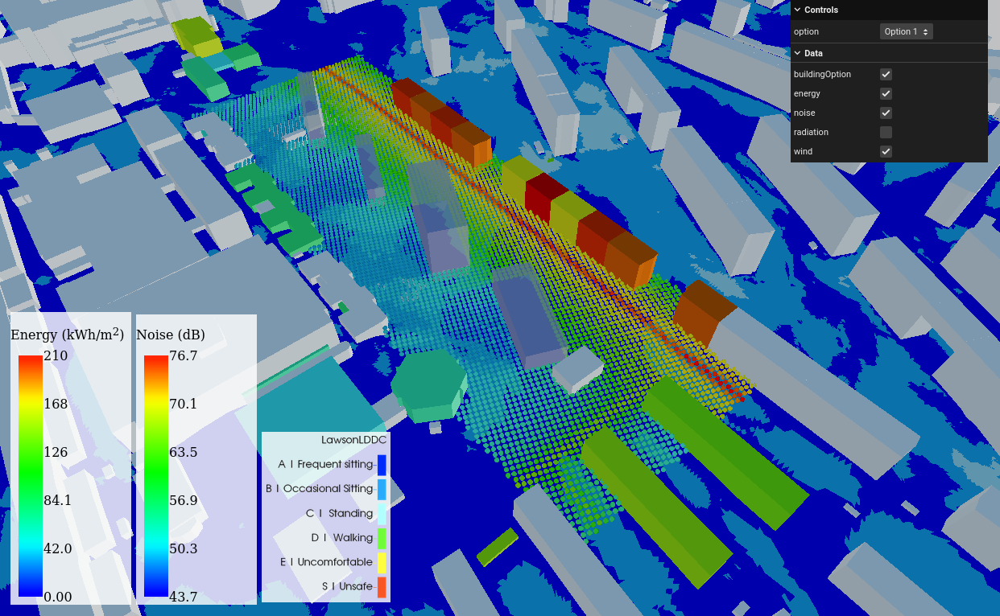

The use of digital twins for multi-domain simulation workflows supporting urban design: A case study in Gothenburg
==================================================================================================================

Authors
-------

-   Alex Gonzalez-Caceresa
-   Franziska Hungerb
-   Jens Forsséna
-   Sanjay Somanatha
-   Andreas Markb
-   Vasilis Naserentinc-e
-   Joakim Bohlinf
-   Anders Loggc
-   Beata Wästbergd
-   Dominika Komisarczyka
-   Fredrik Edelvikb
-   Alexander Hollberga

**a** Department of Architecture and Civil Engineering, Chalmers University of Technology, SE-412 96 Gothenburg, Sweden\
**b** Fraunhofer-Chalmers Research Centre for Industrial Mathematics, Gothenburg, Sweden\
**c** Department of Mathematical Sciences, Chalmers University of Technology, SE-412 96 Gothenburg, Sweden\
**d** Department of Computer Science and Engineering, Chalmers University of Technology, SE-412 96 Gothenburg, Sweden\
**e** Department of Electrical and Computer Engineering, Aristotle University of Thessaloniki, GR- 54124, Thessaloniki, Greece\
**f** Department of Physics, Chalmers University of Technology, SE-412 96 Gothenburg, Sweden

DOI
---

[Add DOI here]

Overview
--------

This repository contains the source code and resources for the interactive WebGL visualization of the multi-domain simulation results supporting urban design in Gothenburg. The visualization displays radiation, noise, and wind data, along with building energy consumption, using an intuitive and interactive interface. The project is built using the [Three.js](https://threejs.org/) JavaScript framework, which allows for efficient 3D rendering in web browsers.

Visit the live visualization at <https://sb-chalmers.github.io/ComputationSustainableDesign/multidomainvis/>

You may also explore the visualisation in VR using WebXR at <https://sb-chalmers.github.io/ComputationSustainableDesign/multidomainvis?vr>

Introduction
============

This project proposes an automated workflow utilizing a digital twin for multi-domain environmental performance analysis of urban developments. The digital twin has the potential to provide a common basis for multi-domain simulations, helping to overcome data availability and interoperability issues. The proposed workflow consists of the following five steps:

1.  Creating a procedural urban 3D model
2.  Generating seven design alternatives parametrically
3.  Exporting the context and each design alternative to each simulation tool
4.  Running simulations for wind comfort, energy demand, and noise for each design alternative
5.  Combining and visualizing the simulation results using the digital twin

The workflow was applied to a neighborhood in Gothenburg, Sweden. The results demonstrate a reduction in manual work required when applying different simulation software for various domains. This is a step forward in streamlining the workflow for urban analysis, particularly important when optimizing designs by comparing multiple variants.

Combining, Visualizing, and Assessing Results
---------------------------------------------

### Base Case and Key Performance Indicators

A base case is established as a reference point for all three domains. Design alternatives are then evaluated based on their performance compared to this base case. Key performance indicators (KPIs) include:

-   Wind comfort level using the Lawson LDDC criterion
-   The percentage of improved area with daytime noise level Lday ≤ 50 dB
-   The relative increase in annual energy demand of existing buildings resulting from each alternative

All numeric results are converted into percentages using area of improvement or energy increase, allowing for combined results and final ranking of design alternatives.

### Visualization Using Three.js

Individual domain results are visualized in a combined view to present to stakeholders. An interactive WebGL visualization was created using the JavaScript framework [Three.js](https://threejs.org/).

-   Radiation and noise results are visualized using point particles colored according to their respective values.
-   Wind results are rendered as a triangulated mesh, colored corresponding to the Lawson LDDC categories of the cells.
-   Building color represents its energy demand.

HTML-based legends show how colors map to simulation result values.

### User Interface and Interaction

The user interface includes a toolbar to select different design alternatives, switching between distinct datasets. The interface also offers the option to toggle different data on or off, such as hiding the wind mesh to avoid occluding the radiation data. This interactive investigation of the results allows for comprehensive communication with stakeholders and enhances the utility of the digital twin.

License
-------

[Add License information here]

Acknowledgments
---------------

We would like to thank Joakim Bohlin for his contribution to the web development of the viewer.
